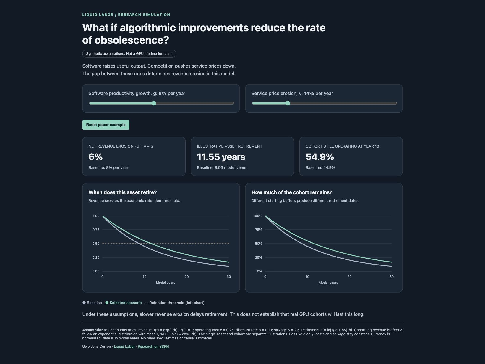

# GPU Depreciation Research

Reproduction code for **When Software Extends GPU Life: Workload Choice and Economic Retirement** by **Uwe Jens Cerron, Liquid Labor**.

[Read the research on SSRN](https://papers.ssrn.com/sol3/papers.cfm?abstract_id=7549859)

## Explore the model

**What if algorithmic improvements reduce the rate of obsolescence?** Change software productivity growth and service price erosion in the [interactive simulation](visuals/simulation.html). Download the repository and open that HTML file in a browser. It works offline, with no installation or account. GitHub displays the source rather than running it.



This screenshot uses the paper's synthetic example: productivity growth of 8% and price erosion of 14% leave revenue erosion of 6% per year. The illustrative asset retires at 11.55 model years, versus 8.66 in the baseline. Cohort survival at year 10 is 54.9%, versus 44.9%. These are model outputs, not observed GPU lifetimes. The cohort mean lifetime in the paper is a different statistic from the individual retirement date shown here.

Try raising price erosion to 30% while holding productivity growth at 8%. The same asset then retires at 3.15 model years. The result depends on the assumptions, not just on software getting better. The controls keep price erosion above productivity growth so the finite-retirement formula applies; raising productivity growth may raise the price slider's minimum.

To reproduce the plotted trajectories as a spreadsheet-readable CSV:

```sh
python3 simulate.py
```

The script writes [visuals/scenarios.csv](visuals/scenarios.csv): three scenarios, 301 time points each. It uses the retirement function from `anc/verify.py`. The dashboard evaluates the same closed-form equations in JavaScript. Its reset button restores the screenshot's assumptions. To recreate the screenshot, open `visuals/simulation.html`, choose **Reset paper example**, and capture the full page in your browser. Font rendering and browser width may change the layout.

The model holds operating costs and salvage constant. Revenue is normalized, time is in model years, and the cohort assumes an exponential distribution of initial log revenue buffers. Full parameters and equations appear below the charts.

## Author

**Uwe Jens Cerron · Liquid Labor**

- Website: [liquid-labor.com](https://liquid-labor.com)
- LinkedIn: [Uwe Cerron](https://www.linkedin.com/in/uwecerron/)
- X / Twitter: [@uwece](https://x.com/uwece)

## Reproduce everything

Install Python 3.9 or newer. No GPU, API key, paid service, or third-party Python package is needed. The default checks use the included data and do not fetch anything from the internet.

Download this repository using GitHub's **Code > Download ZIP** and extract it, or clone it:

```sh
git clone https://github.com/uwecerron/GPU_Depreciation_Research.git
cd GPU_Depreciation_Research
python3 reproduce.py
```

On Windows, use `py -3 reproduce.py` if `python3` is not available. If you downloaded the ZIP, open a terminal in the extracted folder before running the command.

The runner prints five `PASS` lines and ends with `All checks passed.` It checks the dataset SHA-256, theoretical results, screen boundaries, coverage audit, and example output. It runs in a temporary directory so your reference files stay untouched. A mismatch stops the run with an error; do not replace the reference files to hide it. Floating-point comparisons allow relative tolerance 1e-9 and absolute tolerance 1e-10.

The theoretical verification uses a fixed random seed, `20261001`. The numerical checks do not require a fresh price download. Tested with Python 3.9.6.

## Run individual scripts

Python 3 is required. All scripts use the standard library; no packages need installing. Run these commands from this repository directory:

```sh
python3 anc/verify.py
python3 anc/check_screen.py
python3 anc/audit_data.py
python3 anc/retention_screen.py anc/screen-example.json
```

## Files

- `anc/verify.py`: reproduces theoretical examples and checks the retirement model.
- `anc/retention_screen.py`: computes a stationary economic retention screen.
- `anc/check_screen.py`: boundary and input validation checks for that screen.
- `anc/audit_data.py`: audits the coverage of the included frozen rental-price dataset. The optional `--fetch` flag downloads a fresh snapshot and changes the audit inputs.
- `anc/screen-example.json`: synthetic screen inputs.
- `anc/results.json`, `anc/data_audit.json`, and `anc/screen-example-output.json`: reference outputs.
- `anc/proposed-protocol.txt`: proposed empirical protocol, unregistered and unexecuted.

## Scope

Numerical examples are synthetic, not estimates of GPU lifetimes. Algebra and numerical checks do not establish an empirical causal effect. The data audit does not validate contractability, asset value, or a software-release effect. The stationary screen is not a retirement-date forecast.

## Data attribution

The unmodified frozen `anc/data/weekly.json` snapshot comes from [GetDeploying GPU rental price history](https://getdeploying.com/dataset/gpu-prices), distributed under [CC BY 4.0](https://creativecommons.org/licenses/by/4.0/). No endorsement is implied. See `anc/data_audit.json` for provenance and its SHA-256 checksum.

## AI disclosure

OpenAI Codex assisted with derivations, drafting, code, literature searches, and internal adversarial review. That review was not external peer review.

## Reading the results

The synthetic cohort example changes revenue erosion from 0.08 to 0.06 per year. Mean model lifetime changes from 12.5 to about 16.67 years, and the model hazard falls by 25%. These numbers describe an invented cohort, not measured GPU lifetimes.

The rental-price audit covers 15,450 rows in the frozen snapshot. Each selected V100/A100/H100 on-demand series has 53 rows. The selected software-release dates precede this coverage, so the dataset cannot establish their causal effects.

For the stationary screen, copy `anc/screen-example.json` and replace its invented inputs with your own. Keep a common currency and time unit:

| Input | Meaning |
|---|---|
| `feasible` | Whether the hardware can serve this workload |
| `throughput` | Services per active time unit; positive if feasible |
| `utilization` | Fraction of time active, between 0 and 1 |
| `service_price` | Currency received per service |
| `active_cost` | Operating cost per active time unit |
| `fixed_cost` | Retention cost per time unit, including idle time |
| `discount_rate` | Continuous discount rate per time unit |
| `salvage` | Amount received if the asset is retired now |

The margin is `max(0, utilization * (service_price * throughput - active_cost)) - fixed_cost - discount_rate * salvage` for a feasible workload. Infeasible workloads contribute zero operating surplus. A positive margin favors retention under stationary assumptions. It does not predict how long those conditions will last. Document the source of every measured input and update `evidence_status` accurately.

Individual scripts write `anc/results.json`, `anc/data_audit.json`, and `survival.dat` as applicable. The screen prints JSON to the terminal. To save it, use `python3 anc/retention_screen.py anc/screen-example.json > my-screen-results.json`. The single-command runner avoids changing the checked-in references.
